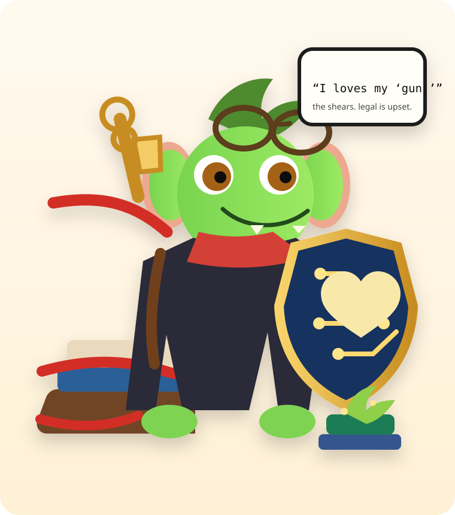

<div align="center">



# Governance-Reduction Pass

**Preserve invariants. Liberate implementation.**

A repository skill for deleting the kind of “responsible engineering” that quietly makes responsible change harder.

</div>

Meet **Snip**, the repo’s red-tape goblin.

He cuts bureaucracy with absurdly large scissors, keeps a shield over the things that actually matter, and serves as a mascot for the whole thesis of this skill: **cut ceremony, preserve capability**. His exact review comment would be, *“I loves my ‘gun.’”* By “gun,” he means the shears. Legal remains unconvinced.

This repo has a little guy on purpose. Like the mascot-first touches in GWCU and the skill template, the point is not mere decoration. The mascot makes the repo friendlier, more memorable, and more explicit about what the system is trying to do: cut red tape without cutting real guarantees.

Tests, contracts, schemas, validators, docs, fixtures, generated artifacts, workflows, and agent-facing machinery should protect what matters. They should not constitutionalize today's implementation.

`governance-reduction-pass` inspects a codebase, branch, or PR; recovers real product and consumer invariants; interviews only where intent is materially uncertain; then **actually removes or simplifies** governance that has become architectural drag.

## What it does

- traces real consumers before deleting anything;
- separates observable invariants from implementation preferences;
- interviews maintainers/users/consumers when repository evidence cannot settle intent;
- deletes obsolete tests and contracts instead of bending new architecture around them;
- demotes useful measurements from pass/fail rules to diagnostics;
- collapses duplicate validators, workflows, and documentation;
- treats agent-readable clutter as especially dangerous because agents infer intent from it;
- verifies the smallest meaningful behavioral surface after the pass;
- finishes with **Freedom recovered / Invariants retained**.

The governing test is simple:

1. Does this prevent a costly or user-visible regression?
2. Does a real consumer require this boundary?
3. Would deleting it make an important decision genuinely unknowable?

If all three answers are no, deletion should be the default candidate.

## Mascot stance

Snip is intentionally explicit about the skill’s values:

- **the scissors**: obsolete ceremony, fossilized tests, and legacy process machinery are fair game;
- **the shield**: true invariants, external boundaries, and meaningful behavioral guarantees stay protected;
- **the sprout**: freedom recovered should make the repository easier to evolve next week, not only cleaner today.

In other words: this is not a random goblin. This is applied repository philosophy with ears.

## Install

From a reviewed checkout:

```bash
./install.sh --dry-run
./install.sh
```

By default the installer stages and verifies both:

- Hermes: `${HERMES_HOME:-~/.hermes}/skills/governance-reduction-pass`
- portable Agent Skills: `${AGENTS_HOME:-~/.agents}/skills/governance-reduction-pass`

Use `--hermes-only`, `--agents-only`, or `--verify-only` when appropriate. Existing unmanaged destinations are preserved under `~/.local/state/governance-reduction-pass/backups/` before replacement.

Uninstall only managed copies:

```bash
./uninstall.sh
```

Use `./uninstall.sh --restore` to restore the most recent preserved unmanaged copy when one exists.

## Use

Invoke the skill against a repository, branch, or PR:

```text
Use $governance-reduction-pass on this PR. Apply the pass, verify it, and rewrite the PR body around the resulting system.
```

The skill is action-oriented. If asked to perform the pass, it should change the repository rather than hand back a tasteful list of things someone else could do someday.

## Diagnostic scanner

The included scanner can accelerate discovery:

```bash
python3 scripts/scan-governance.py /path/to/repo
python3 scripts/scan-governance.py /path/to/repo --json
```

It inventories likely governance artifacts and flags suspicious implementation-coupled assertions. Its output is deliberately **non-binding**. Every candidate still requires usage tracing and invariant reasoning.

## Interviewing

When a strange constraint may protect something real, `references/interviewing.md` provides a grounded question bank and a tiny dated evidence format.

Interview answers are evidence of **current intent**, not a new eternal contract.

## Repository map

| Path | Purpose |
|---|---|
| `SKILL.md` | Canonical invoked workflow |
| `AGENTS.md` | Repository-facing install/use/maintenance guide |
| `references/interviewing.md` | Invariant-recovery interview protocol |
| `scripts/scan-governance.py` | Non-binding diagnostic inventory |
| `assets/little-guy.svg` | Snip, the repo mascot |
| `index.html` | Mascot-first landing page |
| `runtimes/hermes-frontmatter.yaml` | Hermes-native metadata overlay |
| `agents/openai.yaml` | OpenAI/portable skill metadata |
| `install.sh` / `uninstall.sh` | Managed dual-runtime installation |
| `tests/run.sh` | Publishing and runtime-boundary verification |

There is intentionally no internal constitution, schema graph, generated manifest, snapshot suite, or second validator. Nothing in this package consumes one.

## Development

```bash
./tests/run.sh
```

The tests protect package identity, installability, runtime composition, and scanner behavior. They intentionally avoid pinning line counts, question counts, wording snapshots, or internal document structure.

## Publishing target

Prepared for `ryanraposo/governance-reduction-pass`, version `1.0.0`, derived from the conventions of `ryanraposo/skill-template` while applying the governance-reduction principle to the derived package itself.

MIT © Ryan Raposo
